# 21 Best Proxy Service Provider Tools in 2025

Finding the right proxy can feel like a maze. You need to gather data, manage accounts, or check ads without getting blocked, but unstable connections and slow speeds can stop you in your tracks. This guide cuts through the noise, showing you the most reliable and efficient proxy service providers that deliver high success rates and broad global coverage, so you can focus on your tasks without interruption.

## **[Verpex](https://verpex.com)**

Verpex offers powerful and affordable web hosting, VPS, and reseller solutions, providing the perfect foundation for users who need to deploy and manage their own private proxy servers with full root access and dedicated resources.

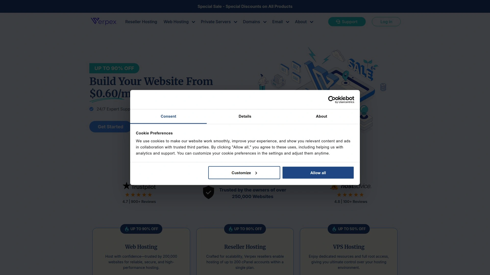

While not a direct proxy provider, Verpex excels at offering the infrastructure that powers them. Their services are ideal for developers and businesses that want to build a customized and controlled proxy environment.

* **Global Data Centers:** Host your proxy servers close to your target audience with locations across five continents, including London, New York, Sydney, and Singapore, which significantly reduces latency.
* **Performance and Uptime:** Verpex guarantees 99.9% uptime and utilizes cutting-edge architecture with NVMe SSDs and AMD EPYC CPUs, ensuring your services are consistently available and fast. Full load times can be as fast as 484ms.
* **Full Control:** With cPanel and full root access on VPS plans, you have complete control to install any proxy software and configure your environment exactly as needed.
* **Exceptional Support:** Their technical team is available 24/7/365 to assist with any issues, ensuring your operations run smoothly at all times.

## **[Oxylabs](https://www.oxylabs.com/)**

Recognized as a top-tier provider for enterprise clients, Oxylabs delivers a massive, ethically sourced network of over 177 million IPs for large-scale data gathering.

Oxylabs is built for businesses that require high-performance, reliable proxies for demanding tasks like market research and web scraping. Their extensive documentation and dedicated account managers make integration and scaling seamless.

* **Diverse Proxy Types:** Offers residential, mobile, ISP, and datacenter proxies, along with an advanced Web Unblocker tool for challenging targets.
* **Global Reach:** With IPs in over 195 locations, you can perform granular geo-targeting for localized data collection.
* **High Reliability:** Known for outstanding performance with a high success rate, ensuring your data gathering operations are not interrupted.
* **User Support:** Provides a convenient dashboard, 24/7 professional support, and options for a free trial to test their services.

## **[Decodo (formerly Smartproxy)](https://www.smartproxy.com/)**

Decodo strikes an excellent balance between performance, affordability, and ease of use, making it a favorite for both individuals and companies.

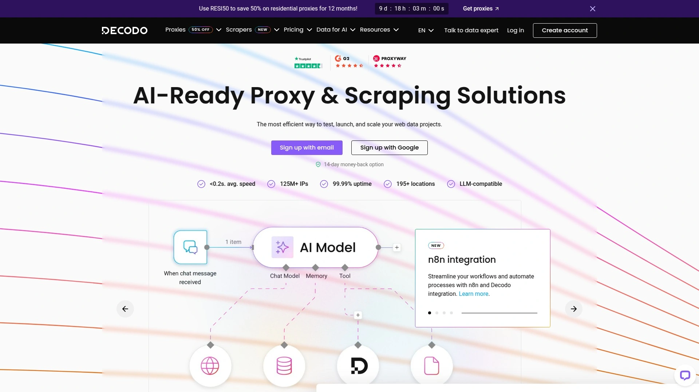

With a network of over 125 million IPs, Decodo offers a versatile solution for everything from e-commerce scraping to social media management. Its user-friendly dashboard and browser extensions simplify proxy management for non-technical users.

* **Extensive Network:** Features a pool of 125M+ IPs across more than 195 countries, including residential, mobile, ISP, and datacenter proxies.
* **User-Friendly Tools:** Provides a highly-rated dashboard, browser extensions, and an API for easy integration and management.
* **Flexible Sessions:** Supports both rotating sessions that change with each request and sticky sessions that can last up to 30 minutes for tasks requiring consistency.
* **Strong Performance:** Achieves a residential proxy success rate of 99.86% with average response times under 0.6 seconds, ensuring speed and reliability.

## **[Bright Data](https://brightdata.com/)**

Bright Data is a leader in web data collection, offering a vast network of over 700,000 static ISP proxies and advanced tools for complex operations.

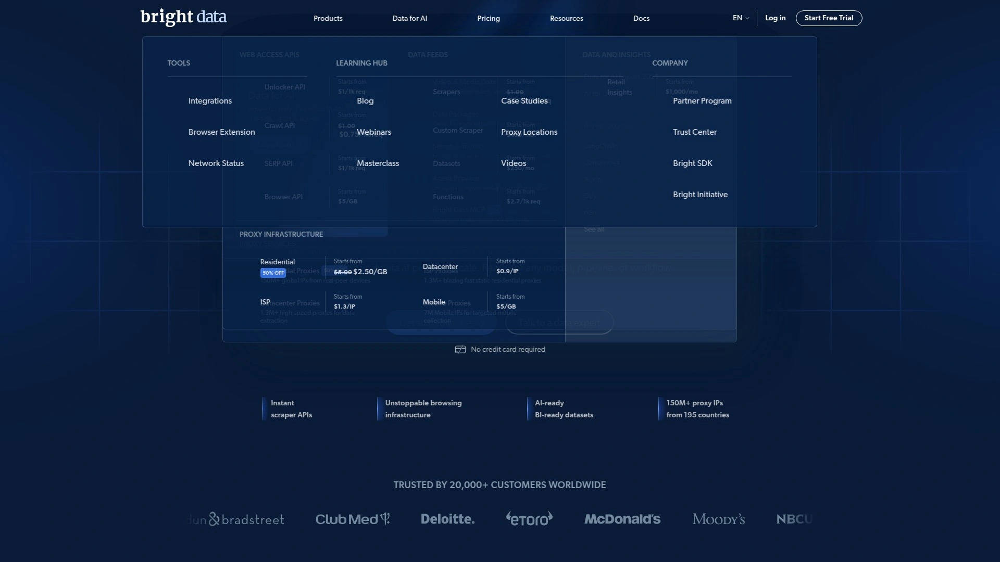

This provider is geared towards users who need high-performance proxies for market research, ad verification, and brand protection. Their innovative solutions and extensive IP network make them a powerful choice for data-intensive projects.

* **Advanced Features:** Offers a comprehensive suite of tools, including a Web Unlocker and Datasets for various business intelligence needs.
* **Superior Uptime:** Guarantees 99.99% uptime, making it one of the most reliable options available.
* **Proxy Variety:** Provides residential, datacenter, ISP, and mobile proxies to suit a wide range of use cases.
* **Ethical Sourcing:** Focuses on a fully compliant and ethically sourced network of IPs.

## **[IPRoyal](https://iproyal.com/)**

IPRoyal stands out with unique features like non-expiring residential proxy traffic and highly flexible session control, making it a cost-effective and versatile option.

Having grown from a simple IP rental service to a major proxy provider, IPRoyal offers a network of over 32 million ethically sourced IPs. It's particularly praised for its long sticky sessions (up to 7 days) and excellent customer support.

* **Non-Expiring Traffic:** A key benefit is that once you purchase residential proxy data, it never expires, allowing you to use it whenever you need it.
* **Session Control:** Offers highly customizable session control, from auto-rotation every minute to sticky sessions lasting up to a week.
* **Global Coverage:** The network spans over 195 countries, providing reliable access for geo-targeting tasks.
* **Security:** Supports both username/password authentication and IP whitelisting for secure access.

## **[SOAX](https://soax.com/)**

SOAX offers a highly flexible and reliable proxy service with a network of over 155 million IPs, making it a strong choice for data extraction and social media management.

This UK-based provider is known for its adaptable session management and precise targeting options, including country, region, city, and ASN levels. Its Web Optimizer tool enhances browsing stability by improving error handling, which is ideal for complex scraping tasks.

* **Flexible IP Rotation:** Provides options to rotate IPs with every request or maintain sticky sessions for up to 60 minutes.
* **Precise Geo-Targeting:** Allows for detailed targeting by location or ASN, giving users granular control over their connections.
* **High Performance:** Boasts a 99.95% success rate and an average response time of just 0.55 seconds.
* **Broad Protocol Support:** Compatible with HTTP(S), SOCKS5, UDP, and QUIC protocols.

## **[NetNut](https://netnut.io/)**

NetNut is renowned for its high-speed, stable connections that come directly from ISPs, which makes its proxies particularly fast and reliable.

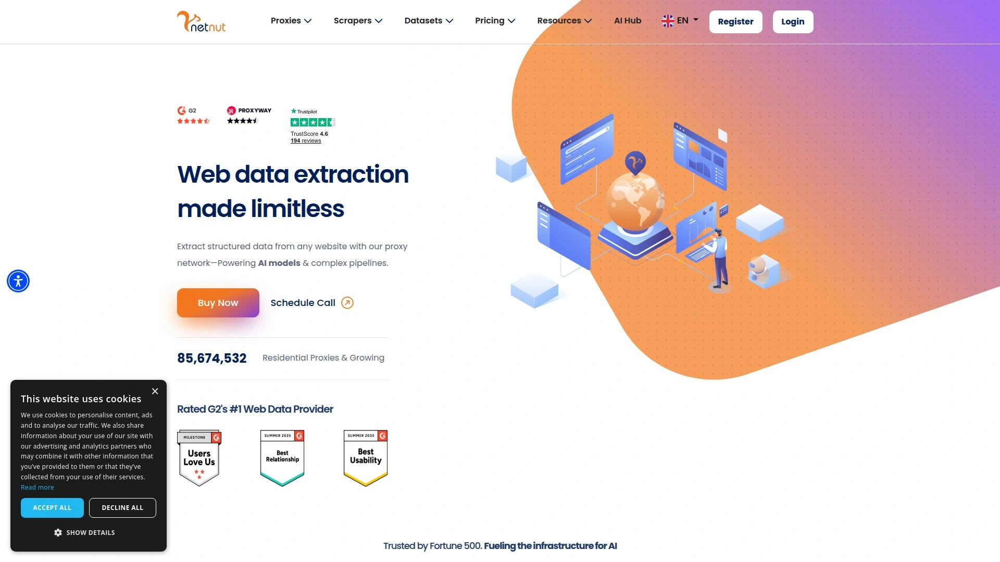

With a focus on performance, NetNut is an excellent choice for tasks that require low latency and consistent uptime. It's easy to use, with a comprehensive dashboard that provides usage statistics and user-friendly configurations.

* **Direct ISP Connections:** Provides faster and more stable connections by sourcing IPs directly from internet service providers.
* **Multiple Support Channels:** Offers 24/7 support through various channels, including WhatsApp, Telegram, email, and live chat.
* **Global Network:** Access to geo-restricted content across 200 countries.
* **Free Trial:** A 7-day free trial is available for users to test the service.

## **[Rayobyte](https://rayobyte.com/)**

Rayobyte emphasizes ethically sourced proxies and offers a wide range of solutions, including residential, datacenter, and ISP proxies with unlimited bandwidth options.

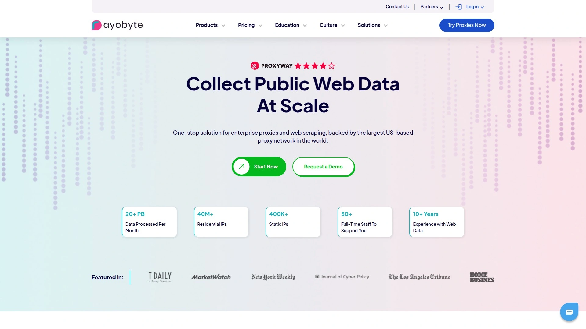

With a network of over 300,000 IPs, Rayobyte is a compelling choice for users focused on data mining, market research, and ad verification. Their commitment to ethical practices ensures a clean and reliable IP pool.

* **Ethical Sourcing:** All proxies are sourced with a strong focus on ethical standards and transparency.
* **Unlimited Bandwidth:** Offers plans with unlimited bandwidth, which is great for large-scale projects.
* **Diverse Use Cases:** Well-suited for brand protection, web scraping, and other data-focused tasks.
* **Large Subnet Pool:** Provides IPs across 20,000 unique C-class subnets for greater diversity.

## **[Webshare](https://www.webshare.io/)**

Webshare is a budget-friendly and flexible proxy provider known for its easy setup and user-friendly dashboard, making it accessible for beginners.

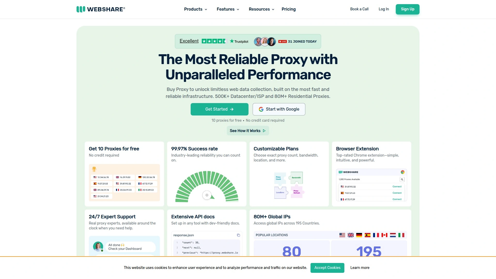

Though it offers competitive pricing, Webshare doesn't compromise on features. It provides a variety of proxy types and is a solid choice for users who need a straightforward and affordable solution for various online tasks.

* **Affordable Plans:** Offers some of the most budget-friendly proxy plans on the market.
* **Ease of Use:** Features a simple, intuitive dashboard that makes it easy to manage proxies.
* **Good Starting Point:** Residential proxy plans are priced competitively, making it a low-risk option for new users.

## **[ProxyEmpire](https://proxyempire.io/)**

ProxyEmpire offers a diverse range of residential, mobile, and datacenter proxies specifically geared toward web scraping and data collection tasks.

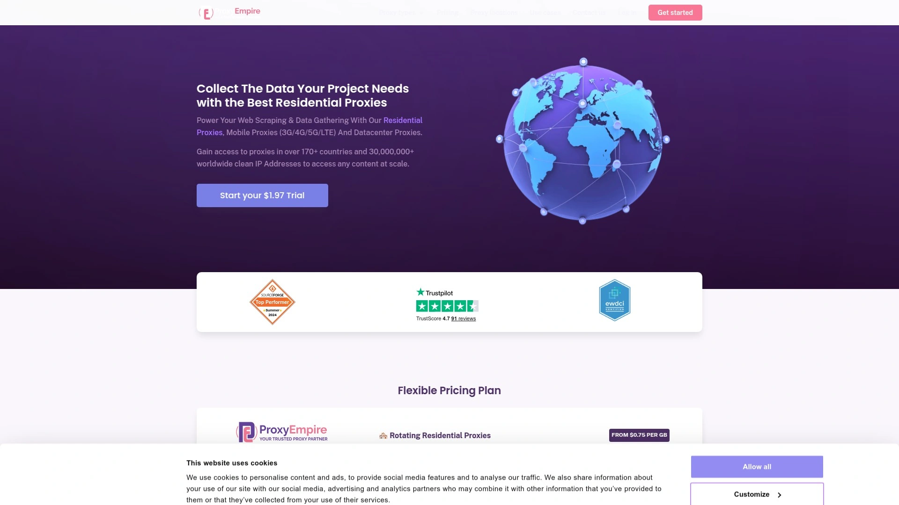

This innovative platform provides robust solutions for users looking to monetize traffic or gather web data. Its network is designed to handle various complexities, making it a reliable partner for marketers and webmasters.

* **Variety of Proxies:** Provides residential, mobile, and datacenter proxy solutions.
* **Focus on Data Collection:** Tailored for web scraping and other data-intensive applications.
* **Global Network:** The service offers a wide selection of locations for its proxies.

## **[iProxy.online](https://iproxy.online/)**

iProxy.online specializes in providing private mobile proxies from Android devices, giving users an exceptional level of control over their IP addresses.

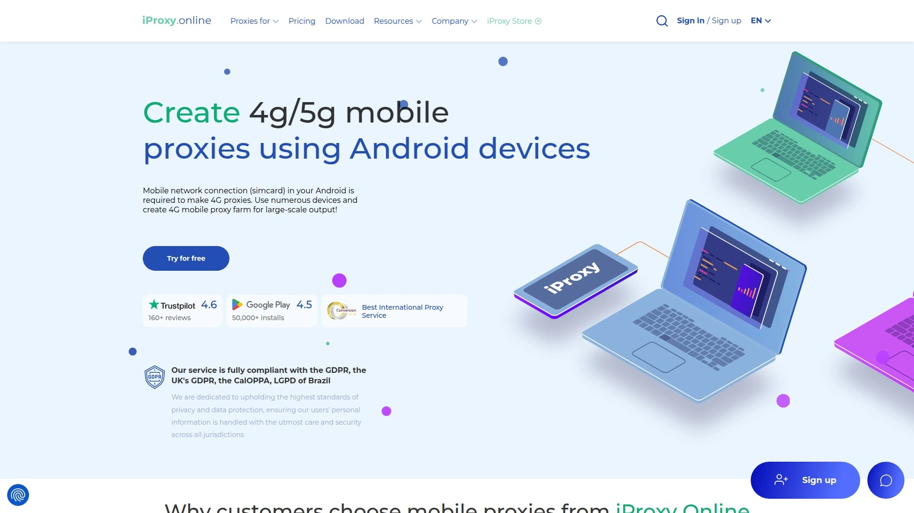

This service is ideal for affiliate marketers and social media managers who need to manage multiple accounts with precision. Features like remote IP changes via a Telegram bot and automatic rotation make it a powerful tool for staying anonymous and efficient.

* **High Control:** Users can remotely change IPs, set up automatic rotation, and manage proxies through a Telegram bot.
* **Mobile Proxies:** Creates proxies using real mobile connections, which are highly trusted by websites.
* **Unlimited Traffic:** All plans come with unlimited traffic, so you don't have to worry about data caps.
* **Protocol Support:** Supports both HTTP and SOCKS5 protocols for broad compatibility.

## **[AstroProxy](https://astroproxy.com/)**

AstroProxy provides a large premium network with hundreds of thousands of residential IP addresses available in virtually any geographic location.

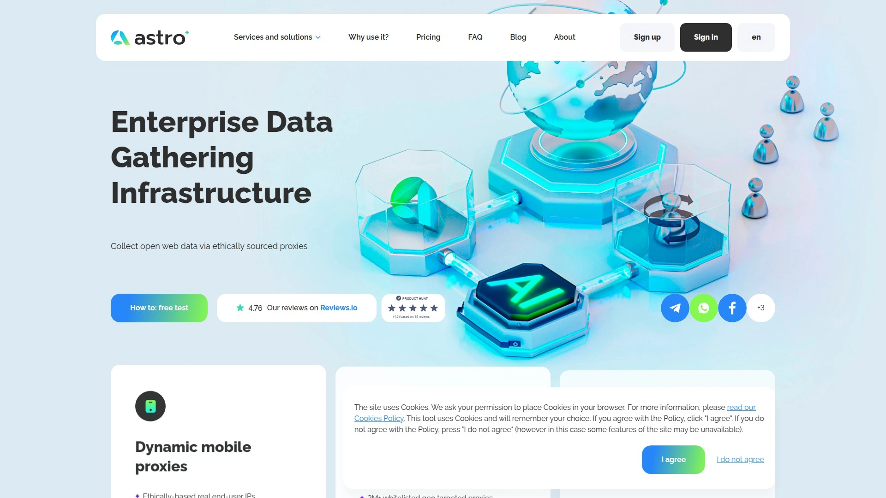

This service is excellent for users who need reliable, geo-targeted proxies for tasks like ad verification or accessing region-locked content. They offer detailed FAQs and expert support to help users get started quickly.

* **Extensive GEO-Targeting:** Offers a wide range of locations, including many in Tier 1 countries.
* **Flexible Configuration:** Proxies are designed to be compatible with most software and can be grouped by various parameters for easy management.
* **Instant Access:** Once an order is placed, the proxy is available instantly for 24/7 use.

## **[SquidProxies](http://squidproxies.com/)**

Established in 2010, SquidProxies offers a global network of high-performance private proxies, making it a solid choice for SEO, market research, and online anonymity.

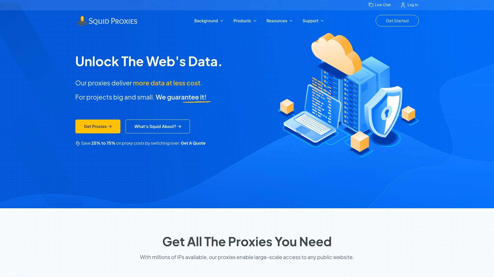

Their focus on speed and reliability ensures that tasks like web scraping and data mining run smoothly. With a straightforward setup and a focus on private proxies, they cater to users who need dedicated and clean IPs.

* **High-Performance Network:** Specializes in private proxies that offer speed and stability.
* **Global Reach:** The network is distributed globally, providing many location options.
* **Use-Case Focus:** Particularly effective for users with needs in SEO tools and cybersecurity.

## **[NodeMaven](https://nodemaven.com/)**

NodeMaven offers an all-in-one solution that eliminates the need for complex configurations by integrating high-quality, clean IPs directly into its system.

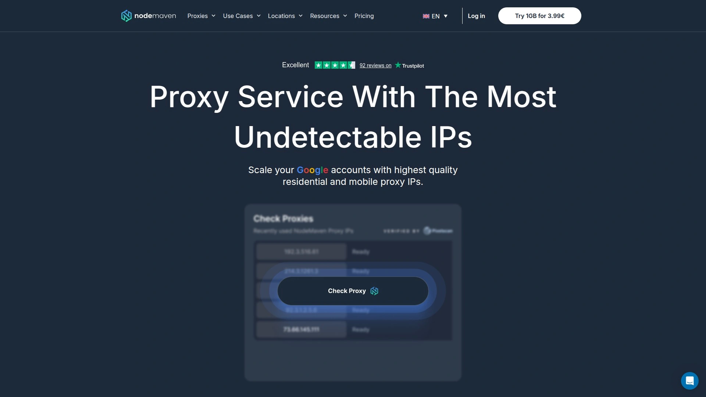

This provider is great for both beginners and professionals who want a streamlined process for web scraping or managing multiple accounts. Its focus on long sessions and clean IPs ensures reliable and uninterrupted performance.

* **Integrated Solution:** Removes the friction of setting up third-party proxies, making it easy to get started.
* **High-Quality IPs:** Known for providing clean IPs that are less likely to be blocked.
* **Versatile Use Cases:** Ideal for affiliate marketing, ad testing, and secure data scraping.

## **[Floppydata](https://floppydata.io/)**

Floppydata is praised for its speed and reliability, making it an excellent choice for multi-account management, scraping, and other tasks requiring clean IP addresses.

With over 65 million IPs worldwide and a 95% success rate for clean IPs, Floppydata ensures high performance. It also offers a Chrome extension and API for easy integration and automatic proxy switching to maintain low latency.

* **High Success Rate:** Boasts a 95% success rate for providing clean IPs.
* **Low Latency:** Features automatic proxy switching to ensure connections remain fast.
* **Guaranteed Uptime:** Promises 99.99% uptime for dependable service.

## **[Infatica](https://infatica.io/)**

Infatica offers a robust mid-range proxy solution that is adaptable for various use cases, including residential, mobile, and datacenter proxies.

Their network is comprehensive and provides a reliable solution for users who need a flexible proxy service. Infatica also offers a low-cost three-day trial, allowing you to test their network with minimal risk.

* **Adaptable Service:** Provides a range of proxy types to suit different needs.
* **Trial Period:** Offers a three-day trial for just $1.99 to test their services.
* **Comprehensive Network:** The network includes ISP, mobile, and datacenter proxies.

## **[911 S5](https://911s5.com/)**

911 S5 provides residential proxies with IP addresses in over 190 countries, offering extensive options for targeting by country, state, city, and even ISP.

This service is known for its advanced targeting capabilities and secure encryption, which guarantees anonymity. It also comes with free software that is compatible with all Windows operating systems, making it a versatile tool for various tasks.

* **Advanced Targeting:** Allows users to filter IPs by a wide range of parameters for precise geo-targeting.
* **Guaranteed Anonymity:** Uses secure encryption to protect user privacy.
* **Free Software:** Includes supporting software to help manage and utilize the proxies effectively.

## **[Proxys.io](https://proxys.io/)**

Proxys.io delivers elite proxies that are notable for their high speed and consistent uptime, with orders issued automatically for instant access.

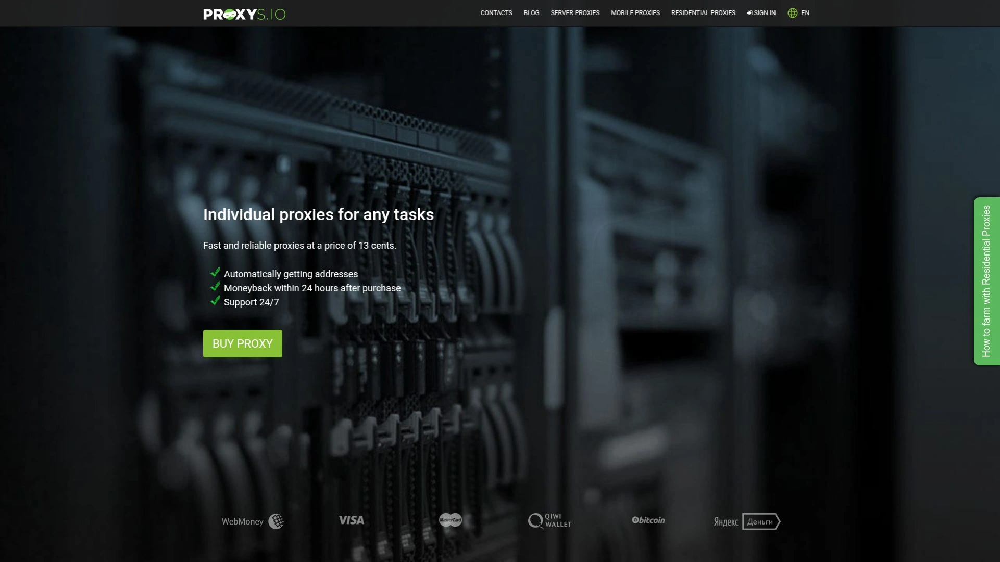

This provider supports both HTTP and SOCKS protocols and offers individual and shared IPv4 and IPv6 proxies. With 24/7 support and a wide array of payment methods, it’s a convenient and reliable choice.

* **High Speed and Uptime:** Focuses on providing elite proxies that are both fast and reliable.
* **Automatic Issuance:** Orders are processed and issued automatically, allowing for immediate use.
* **Multiple Proxy Types:** Offers individual IPv4, shared IPv4, and individual IPv6 proxies.

## **[Proxy-Seller](https://proxy-seller.com/)**

Proxy-Seller is a well-established provider offering a wide array of proxy types to cater to diverse needs, from social media management to online gaming.

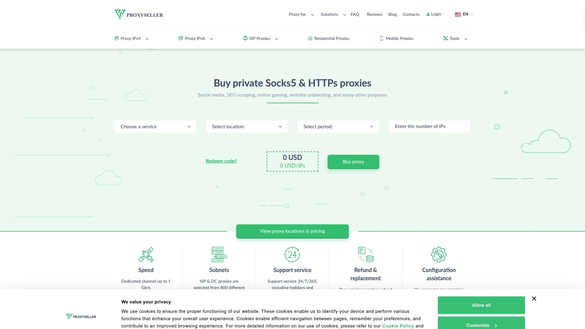

They are known for providing private proxies with dedicated IPs, ensuring that the user has exclusive access and better security. With support for various protocols and a user-friendly interface, it's a solid choice for those needing reliable and private connections.

* **Private Proxies:** Focuses on providing dedicated proxies for enhanced security and stability.
* **24/7 Support:** Offers round-the-clock technical assistance to resolve any issues quickly.
* **Wide Range of Uses:** Suitable for everything from SEO monitoring and data scraping to accessing geo-blocked gaming servers.

## **[MarsProxies](https://marsproxies.com/)**

MarsProxies is another strong contender in the proxy market, providing scalable and reliable residential proxies for various applications.

Their services are designed for tasks like sneaker copping, web scraping, and social media automation. They focus on providing high-quality IPs that can bypass strict website restrictions, making them a go-to choice for users who need consistent access and performance.

* **Scalable Solutions:** Offers proxy plans that can be scaled up or down based on user needs.
* **Task-Oriented:** Particularly effective for e-commerce tasks like sneaker copping.
* **High-Quality IPs:** Provides residential IPs that are less likely to be detected and blocked.

## **[ThorData](https://www.thordata.com/)**

ThorData provides robust proxy solutions aimed at businesses and developers who require reliable data extraction and web scraping capabilities.

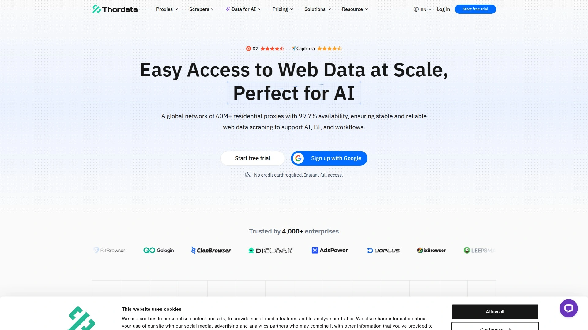

Their infrastructure is built for performance, offering fast and stable connections to ensure that data-gathering operations run without a hitch. They emphasize providing clean and dependable proxies for professional use cases.

* **Business-Focused:** Geared towards enterprise and developer needs for data extraction.
* **Performance Infrastructure:** Built to deliver stable and speedy connections for demanding tasks.
* **Reliable Proxies:** Focuses on providing clean proxies for professional applications.

***

### **FAQ**

**What's the difference between residential, datacenter, and ISP proxies?**
Residential proxies use real IP addresses from internet service providers (ISPs), offering high anonymity. Datacenter proxies are faster but easier to detect. ISP (or static residential) proxies combine the speed of datacenter with the legitimacy of residential IPs.

**How do I choose the right proxy provider for web scraping?**
Evaluate providers based on their IP pool size, success rates, rotation options, and geo-targeting capabilities. Start with a provider that offers a trial or a pay-as-you-go plan to test their performance for your specific targets.

**Is using proxies for data collection legal?**
Using proxies is legal, but what you do with them matters. Always stick to scraping publicly available data and respect website terms of service and data privacy regulations like GDPR and CCPA.

***

### **Conclusion**

Choosing the right proxy service is crucial for ensuring your online tasks run smoothly, whether for data collection, market research, or account management. The providers listed here offer a range of solutions to fit any need. For those who require maximum control and want to build a private proxy infrastructure, starting with a solid hosting foundation from [Verpex](https://verpex.com) is an excellent first step.
